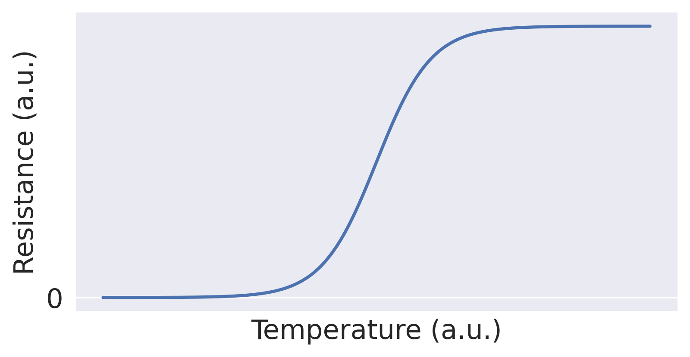
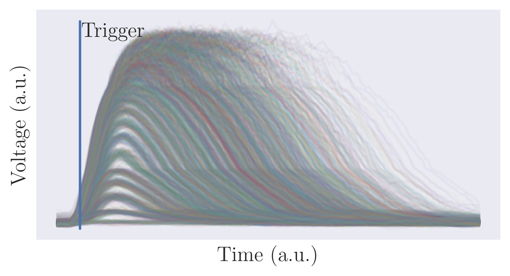
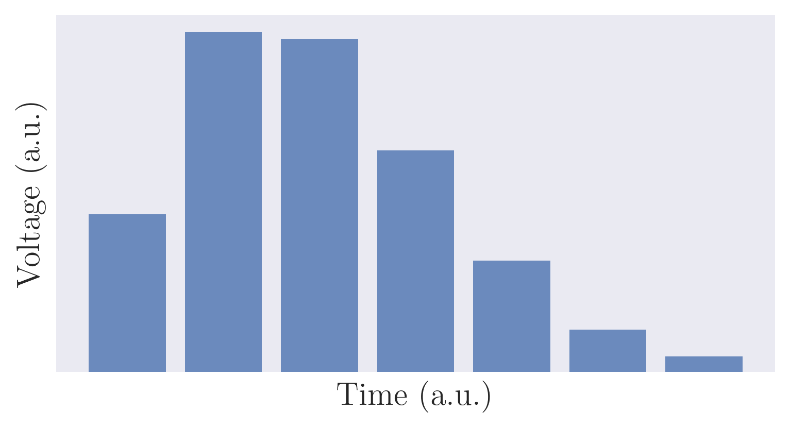

<!-- 
footer:  
-->
## Visibility

---

## Accurate Unsupervised Photon Counting from Transition Edge Sensor Signals

Nicolas Dalbec-Constant

---

## Some Features

#### Response time  : $\sim 10 \mu s$ 
> L. A. Morais et al. (2024), doi: 10.22331/q-2024-05-23-1355.

#### Efficiency : $\sim 98\%$ 
> D. Fukuda et al. (2011), doi: 10.1364/OE.19.000870.

#### Working temperature : $\sim 50-100 mK$ 
> L. A. Morais et al. (2024), doi: 10.22331/q-2024-05-23-1355.

#### Photon number range : 0 to 33 photons 
> M. Eaton et al. (2023), doi: 10.1038/s41566-022-01105-9.

---

## Working Principle

Fig. 1 : Sketch of a TES's resistance variation with temperature.

---

## Signals

Fig. 2 : 3 000 TES signals.

---

## Problem Formulation

1. Signals                       |  2. Process           | 3. Photon Number Distribution
:-------------------------------:|:---------------------:|:-------------------------:
 ||

---

## Historical Methods (Maximum Value)

1. Signals                     |  2. Process             | 3. Photon Number Distribution
:-----------------------------:|:-----------------------:|:-------------------------:
 ||

---

## Historical Methods (Maximum Value)

1. Signals                     |  2. Process             | 3. Photon Number Distribution
:-----------------------------:|:-----------------------:|:-------------------------:
 ||

---

## Confidence

$$
C_n = \int p(n|s) p(s|n) ds = \int \frac{p(s|n)^2p(n)}{p(s)} ds = \int \frac{p(s|n)^2p(n)}{\sum_k p(s|k)p(k)} ds 
$$

- $p(s|n)$ : Probability density for a specific outcome $s$ given an $n$-photon input to the detector.
- $p(n|s)$ : Probability density that the input contained $n$ photons given that the detector measured outcome $s$.

$$
\text{Bayes’ theorem : }\quad p(n|s) =  \frac{p(s|n)p(n)}{p(s)}
$$

---

## Test

---

