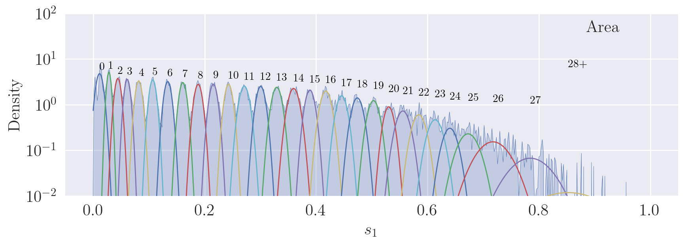
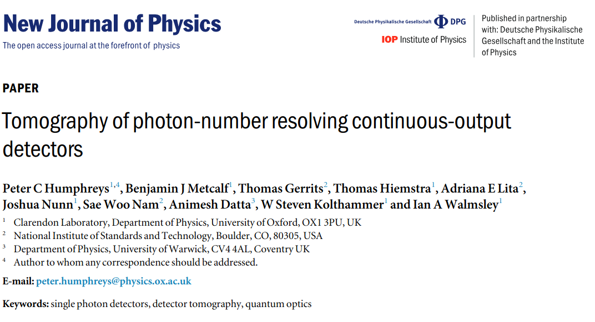

## Visibility

---

## Accurate Unsupervised Photon Counting from Transition Edge Sensor Signals

Nicolas Dalbec-Constant

---

##

---

## Confidence

$$
C_n = \int p(n|s) p(s|n) ds = \int \frac{p(s|n)^2p(n)}{p(s)} ds = \int \frac{p(s|n)^2p(n)}{\sum_k p(s|k)p(k)} ds 
$$

- $p(s|n)$ : Probability density for a specific outcome $s$ given an $n$-photon input to the detector.
- $p(n|s)$ : Probability density that the input contained $n$ photons given that the detector measured outcome $s$.

$$
\text{Bayes’ theorem : }\quad p(n|s) =  \frac{p(s|n)p(n)}{p(s)}
$$

---

## Test

