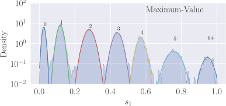
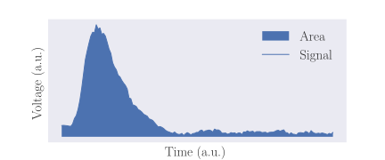
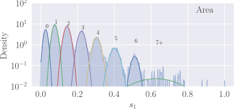
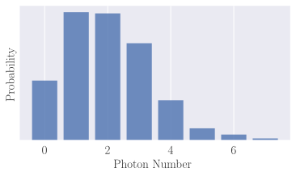

<style>
img[alt~="center"] {
  display: block;
  margin: 0 auto;
}
section {
 font-family: 'Times', sans-serif;
}
</style>

## Code Availability

<center>

Presentation                                          | <center> Full Research   
:----------------------------------------------------:|:-----------------------
 |
INTRIQ-2024                                           | Photon-Number-Classification

</center>

---

## Accurate Unsupervised Photon Counting from Transition Edge Sensor Signals

Nicolas Dalbec-Constant


---

## Some Features

#### Response time  : $\sim 10 \mu s$ 
> L. A. Morais et al. (2024), doi: 10.22331/q-2024-05-23-1355.

#### Efficiency : $\sim 98\%$ 
> D. Fukuda et al. (2011), doi: 10.1364/OE.19.000870.

#### Working temperature : $\sim 50-100 mK$ 
> L. A. Morais et al. (2024), doi: 10.22331/q-2024-05-23-1355.

#### Photon number range : 0 to 33 photons 
> M. Eaton et al. (2023), doi: 10.1038/s41566-022-01105-9.

---

## Working Principle


<p style="text-align:center;">Fig. 1 : Sketch of a TES's resistance variation with temperature.</p>

---

## Signals


<p style="text-align:center;">Fig. 2 : 3 000 TES signals.</p>

---

<!-- 
footer: L. A. Morais et al., “Precisely determining photon-number in real time,” Quantum 1355, May 2024.
-->

## Historical Methods

 1. Operation                               |  2. Latent Space                | 3. Distribution
:------------------------------------------:|:-------------------------------:|:-------------------------:
  | |
          |          |

---

<!-- footer: "" -->

## Dimensionality Reduction

> Process of transforming high-dimensional data into a lower-dimensional representation that retains a maximum of information.

## Clustering

> Clustering refers to identifying groups of similar samples inside a latent space based on some criteria.

## Unsupervised Classification

> Each signal can be associated with a class and the true label of each sample is unknown.

---

## Problem Formulation

```python
def function(Signals : np.array):
  '''
  Function to transform TES signals into photon numbers.

  Parameters
  ----------
  Signals : np.array
    TES signal matrix of shape 
    (number of signals, number of time steps in each signal)

  Returns
  -------
  Photon_Numbers : np.array
    Array that contains the photon number associated with each 
    signal in `Signals`.

  '''
  return Photon_Numbers
```


---

<!-- 
footer: P. C. Humphreys et al., “Tomography of photon-number resolving continuous-output detectors,” New J. Phys., Oct. 2015.
-->

## Principal Component Analysis (PCA)

1. Signals                     |  2. Latent Space             | 3. Distribution
:-----------------------------:|:-----------------------:|:-------------------------:
 ||

---

<!-- 
footer: T. Gerrits et al., “Extending single-photon optimized superconducting transition edge sensors beyond the single-photon counting regime,” Opt. Express, Oct. 2012
-->

## Dataset (NIST)


 Signals                                 |  <center> Expected Distribution           
:---------------------------------------:|:---------------------------------------------
 |


---

<!-- 
footer: ''
-->

## Exploration of Dimensionality Reduction Techniques

Simple Feature                         |  Predictive                                | Non-Predictive
:-------------------------------------:|:------------------------------------------:|:-------------------------:
    |    | 
   |  | 
.                                      |  | 
.                                      | .                                          | 

---

## Exploration of Dimensionality Reduction Techniques

|  Predictive                                | Non-Predictive
|:------------------------------------------:|:-------------------------:
|    | 
| .                                          | 
| .                                          | 
| .                                          | 
| .                                          | 

---

<!-- 
footer: L. Van der Maaten and G. Hinton, “Visualizing data using t-SNE.,” Journal of machine learning research, 2008
-->

## t-distributed stochastic neighbor embedding (t-SNE)

|   | 
|:------------------------------------------:|:-------------------------:


---

<!-- 
footer: [1] L. McInnes, J. Healy, N. Saul, and L. Großberger, “UMAP: Uniform Manifold Approximation and Projection,” Journal of Open Source Software, Sep. 2018
-->

## Uniform Manifold Approximation and Projection (UMAP)

|   | 
|:------------------------------------------:|:-------------------------:


---

<!-- 
footer: P. C. Humphreys et al., “Tomography of photon-number resolving continuous-output detectors,” New J. Phys., Oct. 2015.
-->

## Confidence

$$
C_n = \int \frac{p(s|n)^2p(n)}{\sum_k p(s|k)p(k)} ds 
$$

<!-- <table width="300">
  <tr>
    <td> 
      
      <div> p(s|n) : Probability density for a specific outcome $s$ given an $n$-photon input to the detector $\textbf{(Gaussians)}$.
      </div>
    </td>
    <td> 
       
      <div>
      $p(n)$ : Probability distribution of the light source.
      </div>
    </td>
  </tr>
</table> -->


<center> $p(s\|n)$ : Gaussians      | <center> $p(n)$ : Expected Distribution 
-----------------------------------:|:---------------------------------------
              | 


---

<!-- 
footer: ''
-->

## Benchmark


---

## Benchmark


---

## Outlier Detection (NRC)


---

## Outlier Detection

   | 
--------------------------------:|:-------------------------------:

---

## Outlier Detection


---

## Parametric Implementation of UMAP and t-SNE


---


## Conclusion

- Dimensionality reduction is useful to understand data.
- Nonlinear techniques can improve the photon number resolution of TESs.
- Neural networks provide a precise and efficient platform to achieve photon number prediction.